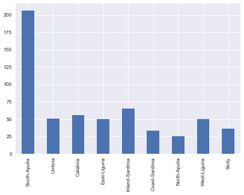
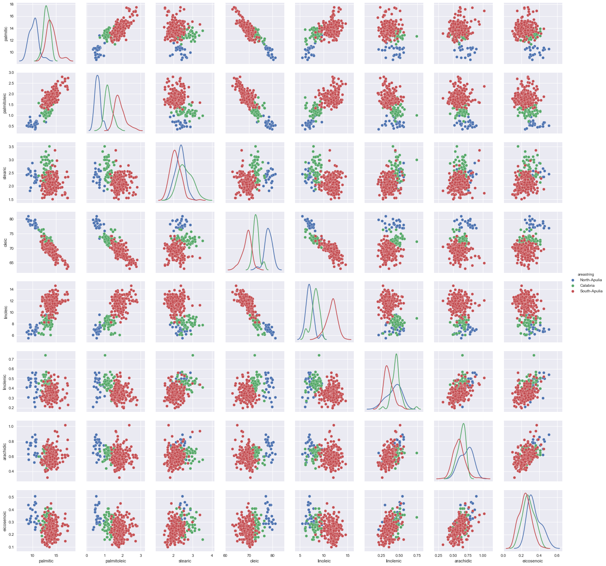

## Contents
{:.no_toc}
*  
{: toc}

## Data Collection
### Data Sources and Description
The data is obtained from two data sources:
- Million Playlist Dataset (http://recsys-challenge.spotify.com)

The data is released from Spotify Lab in early 2018, created by Spotify users between January 2010 and November 2017,
intend to enable playlist research at scale and it represents the largest dataset of music playlists in the world. The MPD was sampled from over 2 billion public playlists on Spotify, and it consists of over 2 million unique tracks by nearly 300,000 artists. In this project, 1 million playlists was used to create the recommendation model, which is about 5.4GB. In each file, there are multiple playlists. Within each playlist, it lists all the tracks in the playlist along with track details such as artists information and Spotify track URIs.

- Spotify API

In order to get more details on the track than what is provided in the MPD, Spotify API is leveraged. From Spotify API, two pieces of information will be obtained. 1. the popularity score of each track 2. Spotify-derived audio features for each track (i.e. danceability and energy)

### Data Conciliation
The MPD provides spotify URIs for tracks within each playlist. The individual spotify URI is then used to make Spotify API requests. The merge of the API results and the MPD is then used for EDA and Model.

Sample dataframe:

```python
df = pd.read_csv("notebooks/sample.csv")
df.head()
```
<div>
<style>
    .dataframe thead tr:only-child th {
        text-align: right;
    }

    .dataframe thead th {
        text-align: left;
    }

    .dataframe tbody tr th {
        vertical-align: top;
    }

</style>
<table border="1" class="dataframe">
  <thead>
    <tr style="text-align: right;">
      <th></th>
      <th>album_name</th>
      <th>album_uri</th>
      <th>artist_name</th>
      <th>artist_uri</th>
      <th>collaborative</th>
      <th>description</th>
      <th>duration_ms</th>
      <th>modified_at</th>
      <th>name</th>
      <th>num_albums</th>
      <th>num_artists</th>
      <th>num_edits</th>
      <th>num_followers</th>
      <th>num_tracks</th>
      <th>pid</th>
      <th>pos</th>
      <th>track_name</th>
      <th>track_uri</th>
      <th>popularity</th>
      <th>acousticness</th>
      <th>analysis_url</th>
      <th>danceability</th>
      <th>track_duration_ms</th>
      <th>energy</th>
      <th>instrumentalness</th>
      <th>key</th>
      <th>liveness</th>
      <th>loudness</th>
      <th>mode</th>
      <th>speechiness</th>
      <th>tempo</th>
      <th>time_signature</th>
      <th>valence</th>
    </tr>
  </thead>
  <tbody>
    <tr>
      <th>0</th>
      <th>Exis</th>
      <th>2vnPwMLtMXZWGkKsoylsGt</th>
      <th>Roy Woods</th>
      <th>7mDU6nMUJnOSY2Hkjz5oqM</th>
      <th>False</th>
      <th>nan</th>
      <th>5030548</th>
      <th>1506384000</th>
      <th>mood</th>
      <th>14</th>
      <th>11</th>
      <th>16</th>
      <th>1</th>
      <th>23</th>
      <th>440000</th>
      <th>0</th>
      <th>Go Go Go</th>
      <th>21bl9jnt8gKltnNYpOPbhw</th>
      <th>47.0</th>
      <th>0.209</th>
      <th>https://api.spotify.com/v1/audio-analysis/21bl9jnt8gKltnNYpOPbhw</th>
      <th>0.637</th>
      <th>245626</th>
      <th>0.365</th>
      <th>1.06e-05</th>
      <th>0</th>
      <th>.0944</th>
      <th>-11.274000000000001</th>
      <th>1</th>
      <th>0.0743</th>
      <th>77.958</th>
      <th>4</th>
      <th>0.0459</th>
    </tr>
    <tr>
      <th>1</th>
      <th>Hold On/Night Moves</th>
      <th>1qOe0cNJmiMHdDiChatmFV</th>
      <th>Roosevelt</th>
      <th>4AQrqVz6BYwy29iMxcGtx7</th>
      <th>False</th>
      <th>nan</th>
      <th>30082331</th>
      <th>1495497600</th>
      <th>costa rica</th>
      <th>108</th>
      <th>95</th>
      <th>79</th>
      <th>4</th>
      <th>118</th>
      <th>440353</th>
      <th>86</th>
      <th>Hold On</th>
      <th>2Mdw2rZMq0oFK3oDCbUZQz</th>
      <th>0.0</th>
      <th>0.0205</th>
      <th>https://api.spotify.com/v1/audio-analysis/2Mdw2rZMq0oFK3oDCbUZQz</th>
      <th>0.691</th>
      <th>206667</th>
      <th>0.693</th>
      <th>0.47</th>
      <th>4</th>
      <th>0.26899999999999996</th>
      <th>-7.647</th>
      <th>1</th>
      <th>0.0426</th>
      <th>114.23899999999999</th>
      <th>4</th>
      <th>0.815</th>
    </tr>
    <tr>
      <th>2</th>
      <th>What Do You Think About the Car?</th>
      <th>3HJiLDJgWA9Z0MvCxlzHYQ</th>
      <th>Declan McKenna</th>
      <th>2D4FOOOtWycb3Aw9nY5n3c</th>
      <th>False</th>
      <th>nan</th>
      <th>44201804</th>
      <th>1504569600</th>
      <th>heart strings</th>
      <th>174</th>
      <th>146</th>
      <th>120</th>
      <th>15</th>
      <th>188</th>
      <th>440188</th>
      <th>158</th>
      <th>Brazil</th>
      <th>4sNG6zQBmtq7M8aeeKJRMQ</th>
      <th>65.0</th>
      <th>0.0941</th>
      <th>https://api.spotify.com/v1/audio-analysis/4sNG6zQBmtq7M8aeeKJRMQ</th>
      <th>0.687</th>
      <th>252307</th>
      <th>0.617</th>
      <th>1.32e-05</th>
      <th>4</th>
      <th>0.0898</th>
      <th>-5.212999999999999</th>
      <th>1</th>
      <th>0.0287</th>
      <th>121.08</th>
      <th>4</th>
      <th>0.665</th>
    </tr>
    <tr>
      <th>3</th>
      <th>Reach For Glory</th>
      <th>0XHpO9qTpqJJQwa2zFxAAE</th>
      <th>Blackmill</th>
      <th>4kjWnaLfIRcLJ1Dy4Wr6tY</th>
      <th>False</th>
      <th>nan</th>
      <th>13610945</th>
      <th>1419811200</th>
      <th>Wub Wub</th>
      <th>31</th>
      <th>24</th>
      <th>12</th>
      <th>1</th>
      <th>49</th>
      <th>440253</th>
      <th>39</th>
      <th>In The Night Of Wilderness</th>
      <th>3RZzg8yZs5HaRjQiDiBIsV</th>
      <th>40.0</th>
      <th>0.00233</th>
      <th>https://api.spotify.com/v1/audio-analysis/3RZzg8yZs5HaRjQiDiBIsV</th>
      <th>0.5489999999999999</th>
      <th>327004</th>
      <th>0.789</th>
      <th>0.5579999999999999</th>
      <th>4</th>
      <th>0.244</th>
      <th>-7.553</th>
      <th>0</th>
      <th>0.0315</th>
      <th>140.026</th>
      <th>4</th>
      <th>0.0705</th>
    </tr>
    <tr>
      <th>4</th>
      <th>I Can't Stop the Feeling (When You Keep Dancing Just So Good)</th>
      <th>0LMRJHZy2pnBehLHYRU5cO</th>
      <th>I Can't Breathe</th>
      <th>5MK9x0RbHMQFGDAknCMVeF</th>
      <th>False</th>
      <th>nan</th>
      <th>25995379</th>
      <th>1508371200</th>
      <th>music</th>
      <th>105</th>
      <th>89</th>
      <th>55</th>
      <th>1</th>
      <th>113</th>
      <th>440266</th>
      <th>54</th>
      <th>Can't Stop the Feeling</th>
      <th>0zmXotS8KeYXR3zMT0SQWm</th>
      <th>25.0</th>
      <th>0.0532</th>
      <th>https://api.spotify.com/v1/audio-analysis/0zmXotS8KeYXR3zMT0SQWm</th>
      <th>0.679</th>
      <th>232859</th>
      <th>0.725</th>
      <th>0.000324</th>
      <th>6</th>
      <th>0.34299999999999997</th>
      <th>-7.952999999999999</th>
      <th>1</th>
      <th>0.04</th>
      <th>116.354</th>
      <th>4</th>
      <th>0.917</th>
    </tr>
  </tbody>
</table>
</div>


```python
%matplotlib inline
import numpy as np
import matplotlib.pyplot as plt
import pandas as pd
import seaborn as sns
pd.set_option('display.width', 500)
pd.set_option('display.max_columns', 100)
```


## Italian Olives


I found this data set in the RGGobi book (http://www.ggobi.org/book/), from which the above diagram is taken. It has "the percentage composition of fatty acids
found in the lipid fraction of Italian olive oils', with oils from 3 regions of Italy: the North, the South, and Sardinia. The regions themselves are subdivided into areas as shown in the map above. The source for this data is:

>Forina, M., Armanino, C., Lanteri, S. & Tiscornia, E. (1983), Classification of Olive Oils from their Fatty Acid Composition, in Martens, H. and
Russwurm Jr., H., eds, Food Research and Data Analysis, Applied Science
Publishers, London, pp. 189–214.

## Exploratory Viz


```python
df = pd.read_csv("local-olives-cleaned.csv")
df.head()
```


<div>
<style>
    .dataframe thead tr:only-child th {
        text-align: right;
    }

    .dataframe thead th {
        text-align: left;
    }

    .dataframe tbody tr th {
        vertical-align: top;
    }
</style>
<table border="1" class="dataframe">
  <thead>
    <tr style="text-align: right;">
      <th></th>
      <th>areastring</th>
      <th>region</th>
      <th>area</th>
      <th>palmitic</th>
      <th>palmitoleic</th>
      <th>stearic</th>
      <th>oleic</th>
      <th>linoleic</th>
      <th>linolenic</th>
      <th>arachidic</th>
      <th>eicosenoic</th>
      <th>regionstring</th>
    </tr>
  </thead>
  <tbody>
    <tr>
      <th>0</th>
      <td>North-Apulia</td>
      <td>1</td>
      <td>1</td>
      <td>10.75</td>
      <td>0.75</td>
      <td>2.26</td>
      <td>78.23</td>
      <td>6.72</td>
      <td>0.36</td>
      <td>0.60</td>
      <td>0.29</td>
      <td>South</td>
    </tr>
    <tr>
      <th>1</th>
      <td>North-Apulia</td>
      <td>1</td>
      <td>1</td>
      <td>10.88</td>
      <td>0.73</td>
      <td>2.24</td>
      <td>77.09</td>
      <td>7.81</td>
      <td>0.31</td>
      <td>0.61</td>
      <td>0.29</td>
      <td>South</td>
    </tr>
    <tr>
      <th>2</th>
      <td>North-Apulia</td>
      <td>1</td>
      <td>1</td>
      <td>9.11</td>
      <td>0.54</td>
      <td>2.46</td>
      <td>81.13</td>
      <td>5.49</td>
      <td>0.31</td>
      <td>0.63</td>
      <td>0.29</td>
      <td>South</td>
    </tr>
    <tr>
      <th>3</th>
      <td>North-Apulia</td>
      <td>1</td>
      <td>1</td>
      <td>9.66</td>
      <td>0.57</td>
      <td>2.40</td>
      <td>79.52</td>
      <td>6.19</td>
      <td>0.50</td>
      <td>0.78</td>
      <td>0.35</td>
      <td>South</td>
    </tr>
    <tr>
      <th>4</th>
      <td>North-Apulia</td>
      <td>1</td>
      <td>1</td>
      <td>10.51</td>
      <td>0.67</td>
      <td>2.59</td>
      <td>77.71</td>
      <td>6.72</td>
      <td>0.50</td>
      <td>0.80</td>
      <td>0.46</td>
      <td>South</td>
    </tr>
  </tbody>
</table>
</div>


### exploring globally


```python
pd.crosstab(df.areastring, df.regionstring)
```


<div>
<style>
    .dataframe thead tr:only-child th {
        text-align: right;
    }

    .dataframe thead th {
        text-align: left;
    }

    .dataframe tbody tr th {
        vertical-align: top;
    }
</style>
<table border="1" class="dataframe">
  <thead>
    <tr style="text-align: right;">
      <th>regionstring</th>
      <th>North</th>
      <th>Sardinia</th>
      <th>South</th>
    </tr>
    <tr>
      <th>areastring</th>
      <th></th>
      <th></th>
      <th></th>
    </tr>
  </thead>
  <tbody>
    <tr>
      <th>Calabria</th>
      <td>0</td>
      <td>0</td>
      <td>56</td>
    </tr>
    <tr>
      <th>Coast-Sardinia</th>
      <td>0</td>
      <td>33</td>
      <td>0</td>
    </tr>
    <tr>
      <th>East-Liguria</th>
      <td>50</td>
      <td>0</td>
      <td>0</td>
    </tr>
    <tr>
      <th>Inland-Sardinia</th>
      <td>0</td>
      <td>65</td>
      <td>0</td>
    </tr>
    <tr>
      <th>North-Apulia</th>
      <td>0</td>
      <td>0</td>
      <td>25</td>
    </tr>
    <tr>
      <th>Sicily</th>
      <td>0</td>
      <td>0</td>
      <td>36</td>
    </tr>
    <tr>
      <th>South-Apulia</th>
      <td>0</td>
      <td>0</td>
      <td>206</td>
    </tr>
    <tr>
      <th>Umbria</th>
      <td>51</td>
      <td>0</td>
      <td>0</td>
    </tr>
    <tr>
      <th>West-Liguria</th>
      <td>50</td>
      <td>0</td>
      <td>0</td>
    </tr>
  </tbody>
</table>
</div>


```python
pd.value_counts(df.areastring, sort=False).plot(kind="bar");
```





```python
pd.value_counts(df.regionstring, sort=False).plot(kind="barh");
```


```python
acidlist=['palmitic', 'palmitoleic', 'stearic', 'oleic', 'linoleic', 'linolenic', 'arachidic', 'eicosenoic']
df[acidlist].median().plot(kind="bar");
```


Or one can use `aggregate` to pass an arbitrary function of to the sub-dataframe. The function is applied columnwise.


```python
dfbymean=df.groupby("regionstring").aggregate(np.mean)
dfbymean.head()
```


<div>
<style>
    .dataframe thead tr:only-child th {
        text-align: right;
    }

    .dataframe thead th {
        text-align: left;
    }

    .dataframe tbody tr th {
        vertical-align: top;
    }
</style>
<table border="1" class="dataframe">
  <thead>
    <tr style="text-align: right;">
      <th></th>
      <th>region</th>
      <th>area</th>
      <th>palmitic</th>
      <th>palmitoleic</th>
      <th>stearic</th>
      <th>oleic</th>
      <th>linoleic</th>
      <th>linolenic</th>
      <th>arachidic</th>
      <th>eicosenoic</th>
    </tr>
    <tr>
      <th>regionstring</th>
      <th></th>
      <th></th>
      <th></th>
      <th></th>
      <th></th>
      <th></th>
      <th></th>
      <th></th>
      <th></th>
      <th></th>
    </tr>
  </thead>
  <tbody>
    <tr>
      <th>North</th>
      <td>3.0</td>
      <td>8.006623</td>
      <td>10.948013</td>
      <td>0.837351</td>
      <td>2.308013</td>
      <td>77.930530</td>
      <td>7.270331</td>
      <td>0.217881</td>
      <td>0.375762</td>
      <td>0.019735</td>
    </tr>
    <tr>
      <th>Sardinia</th>
      <td>2.0</td>
      <td>5.336735</td>
      <td>11.113469</td>
      <td>0.967449</td>
      <td>2.261837</td>
      <td>72.680204</td>
      <td>11.965306</td>
      <td>0.270918</td>
      <td>0.731735</td>
      <td>0.019388</td>
    </tr>
    <tr>
      <th>South</th>
      <td>1.0</td>
      <td>2.783282</td>
      <td>13.322879</td>
      <td>1.548019</td>
      <td>2.287740</td>
      <td>71.000093</td>
      <td>10.334985</td>
      <td>0.380650</td>
      <td>0.631176</td>
      <td>0.273220</td>
    </tr>
  </tbody>
</table>
</div>


```python
with sns.axes_style("white", {'grid':False}):
    dfbymean[acidlist].plot(kind='barh', stacked=True);
    sns.despine()
```


## Figuring the dataset by Region


```python
g=sns.FacetGrid(df, col="region")
g.map(plt.scatter,"eicosenoic", "linoleic");
```


Clearly, region 1 or the South can visually be separated out by `eicosenoic` fraction itself.


```python
with sns.axes_style("white"):
    g=sns.FacetGrid(df, col="region")
    g.map(sns.distplot, "eicosenoic")
```


We make a SPLOM using `seaborn` to see in what space the regions may be separated. Note that linoleic and oleic seem promising. And perhaps arachidic paired with eicosenoic.


```python
sns.pairplot(df, vars=acidlist, hue="regionstring", size=2.5, diag_kind='kde');
```


Pandas supports conditional indexing: <a href="http://pandas.pydata.org/pandas-docs/dev/indexing.html#boolean-indexing">documentation</a>. Lets use it to follow up on the clear pattern of Southern oils seeeming to be separable by just the `eicosenoic` feature.

**Indeed this is the case!** Can also be seen using parallel co-ordinates:


```python
from pandas.tools.plotting import parallel_coordinates
dfna=df[acidlist]
#normalizing by range
dfna_norm = (dfna - dfna.mean()) / (dfna.max() - dfna.min())
with sns.axes_style("white"):
    parallel_coordinates(df[['regionstring']].join(dfna_norm), 'regionstring', alpha=0.3)
```


## Figuring the South of Italy by Area


```python
dfsouth=df[df.regionstring=='South']
dfsouth.head()
```


<div>
<style>
    .dataframe thead tr:only-child th {
        text-align: right;
    }

    .dataframe thead th {
        text-align: left;
    }

    .dataframe tbody tr th {
        vertical-align: top;
    }
</style>
<table border="1" class="dataframe">
  <thead>
    <tr style="text-align: right;">
      <th></th>
      <th>areastring</th>
      <th>region</th>
      <th>area</th>
      <th>palmitic</th>
      <th>palmitoleic</th>
      <th>stearic</th>
      <th>oleic</th>
      <th>linoleic</th>
      <th>linolenic</th>
      <th>arachidic</th>
      <th>eicosenoic</th>
      <th>regionstring</th>
    </tr>
  </thead>
  <tbody>
    <tr>
      <th>0</th>
      <td>North-Apulia</td>
      <td>1</td>
      <td>1</td>
      <td>10.75</td>
      <td>0.75</td>
      <td>2.26</td>
      <td>78.23</td>
      <td>6.72</td>
      <td>0.36</td>
      <td>0.60</td>
      <td>0.29</td>
      <td>South</td>
    </tr>
    <tr>
      <th>1</th>
      <td>North-Apulia</td>
      <td>1</td>
      <td>1</td>
      <td>10.88</td>
      <td>0.73</td>
      <td>2.24</td>
      <td>77.09</td>
      <td>7.81</td>
      <td>0.31</td>
      <td>0.61</td>
      <td>0.29</td>
      <td>South</td>
    </tr>
    <tr>
      <th>2</th>
      <td>North-Apulia</td>
      <td>1</td>
      <td>1</td>
      <td>9.11</td>
      <td>0.54</td>
      <td>2.46</td>
      <td>81.13</td>
      <td>5.49</td>
      <td>0.31</td>
      <td>0.63</td>
      <td>0.29</td>
      <td>South</td>
    </tr>
    <tr>
      <th>3</th>
      <td>North-Apulia</td>
      <td>1</td>
      <td>1</td>
      <td>9.66</td>
      <td>0.57</td>
      <td>2.40</td>
      <td>79.52</td>
      <td>6.19</td>
      <td>0.50</td>
      <td>0.78</td>
      <td>0.35</td>
      <td>South</td>
    </tr>
    <tr>
      <th>4</th>
      <td>North-Apulia</td>
      <td>1</td>
      <td>1</td>
      <td>10.51</td>
      <td>0.67</td>
      <td>2.59</td>
      <td>77.71</td>
      <td>6.72</td>
      <td>0.50</td>
      <td>0.80</td>
      <td>0.46</td>
      <td>South</td>
    </tr>
  </tbody>
</table>
</div>


We make a couple of SPLOM's, one with sicily and one without sicily, to see whats separable. Sicily seems to be a problem. As before, see the KDE's first to see if separability exists and then let the eye look for patterns.


```python
sns.pairplot(dfsouth, hue="areastring", size=2.5, vars=acidlist, diag_kind='kde');
```


```python
sns.pairplot(dfsouth[dfsouth.areastring!="Sicily"], hue="areastring", size=2.5, vars=acidlist, diag_kind='kde');
```





Seems that combinations of oleic, palmitic, palmitoleic might be useful?
