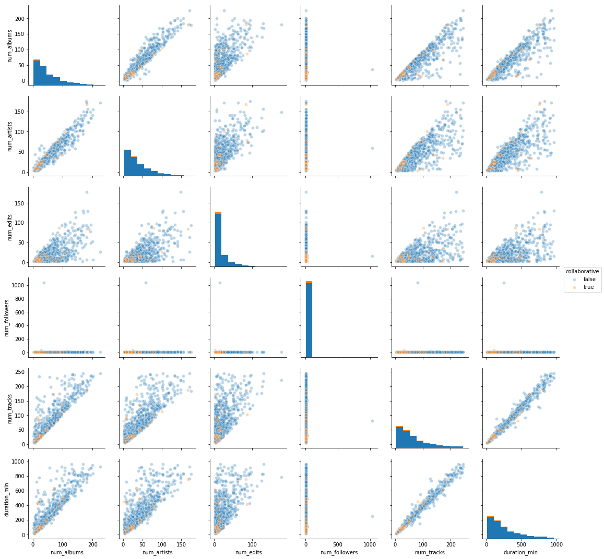
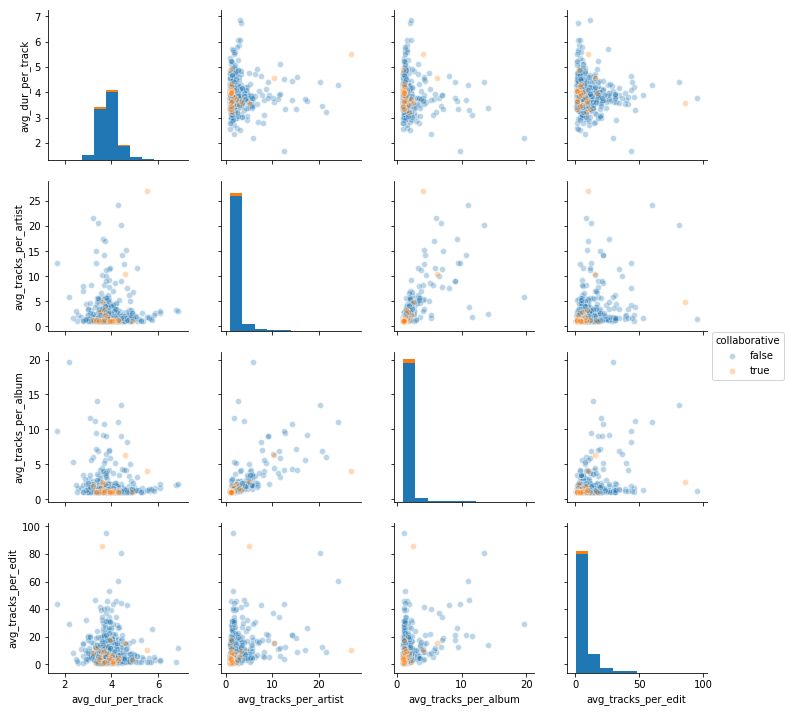
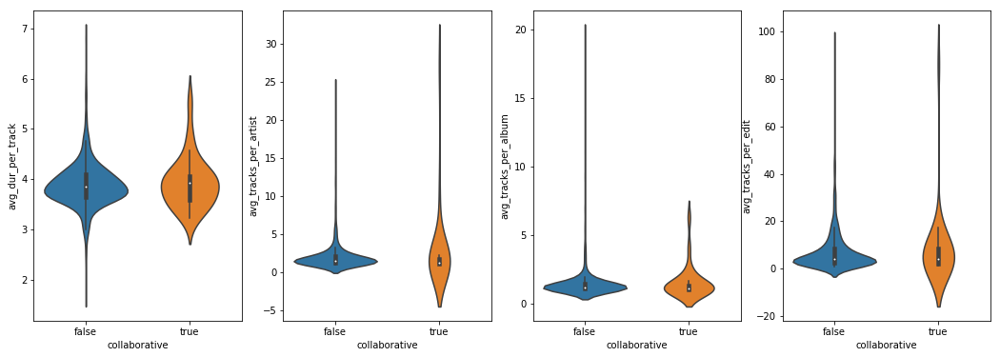
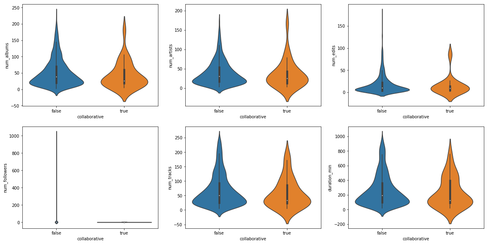
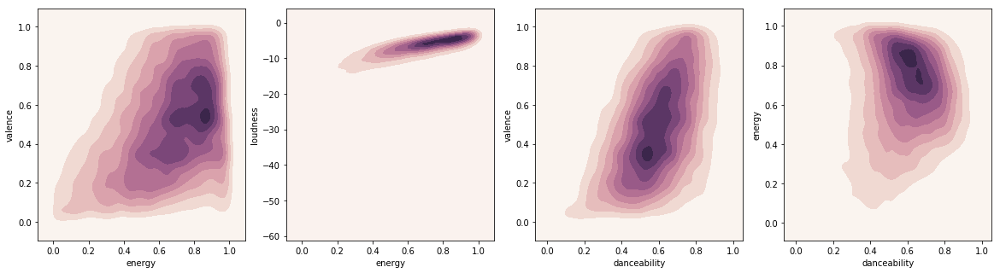
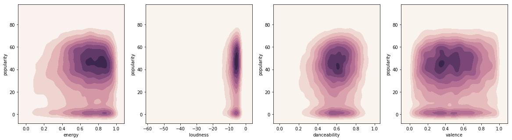

## Contents
{:.no_toc}
*  
{: toc}

## Data Collection
### Data Sources and Description
The data is obtained from two data sources:
- Million Playlist Dataset (http://recsys-challenge.spotify.com)

The data is released from Spotify Lab in early 2018, created by Spotify users between January 2010 and November 2017,
intend to enable playlist research at scale and it represents the largest dataset of music playlists in the world. The MPD was sampled from over 2 billion public playlists on Spotify, and it consists of over 2 million unique tracks by nearly 300,000 artists. In this project, 1 million playlists was used to create the recommendation model, which is about 5.4GB. In each file, there are multiple playlists. Within each playlist, it lists all the tracks in the playlist along with track details such as artists information and Spotify track URIs.

- Spotify API

In order to get more details on the track than what is provided in the MPD, Spotify API is leveraged. From Spotify API, two pieces of information will be obtained. 1. the popularity score of each track 2. Spotify-derived audio features for each track (i.e. danceability and energy)

### Data Conciliation
The MPD provides spotify URIs for tracks within each playlist. The individual spotify URI is then used to make Spotify API requests. The merge of the API results and the MPD is then used for EDA and Model. Some duplicated columns like type and track_href are dropped.

Sample dataframe:

```python
df = pd.read_csv("notebooks/sample.csv")
df.head()
```
<div>
<style>
    .dataframe thead tr:only-child th {
        text-align: right;
    }

    .dataframe thead th {
        text-align: left;
    }

    .dataframe tbody tr th {
        vertical-align: top;
    }

</style>
<table border="1" class="dataframe">
  <thead>
    <tr style="text-align: right;">
      <th></th>
      <th>album_name</th>
      <th>album_uri</th>
      <th>artist_name</th>
      <th>artist_uri</th>
      <th>collaborative</th>
      <th>description</th>
      <th>duration_ms</th>
      <th>modified_at</th>
      <th>name</th>
      <th>num_albums</th>
      <th>num_artists</th>
      <th>num_edits</th>
      <th>num_followers</th>
      <th>num_tracks</th>
      <th>pid</th>
      <th>pos</th>
      <th>track_name</th>
      <th>track_uri</th>
      <th>popularity</th>
      <th>acousticness</th>
      <th>analysis_url</th>
      <th>danceability</th>
      <th>track_duration_ms</th>
      <th>energy</th>
      <th>instrumentalness</th>
      <th>key</th>
      <th>liveness</th>
      <th>loudness</th>
      <th>mode</th>
      <th>speechiness</th>
      <th>tempo</th>
      <th>time_signature</th>
      <th>valence</th>
    </tr>
  </thead>
  <tbody>
    <tr>
      <th>0</th>
      <th>Exis</th>
      <th>2vnPwMLtMXZWGkKsoylsGt</th>
      <th>Roy Woods</th>
      <th>7mDU6nMUJnOSY2Hkjz5oqM</th>
      <th>False</th>
      <th>nan</th>
      <th>5030548</th>
      <th>1506384000</th>
      <th>mood</th>
      <th>14</th>
      <th>11</th>
      <th>16</th>
      <th>1</th>
      <th>23</th>
      <th>440000</th>
      <th>0</th>
      <th>Go Go Go</th>
      <th>21bl9jnt8gKltnNYpOPbhw</th>
      <th>47.0</th>
      <th>0.209</th>
      <th>https://api.spotify.com/v1/audio-analysis/21bl9jnt8gKltnNYpOPbhw</th>
      <th>0.637</th>
      <th>245626</th>
      <th>0.365</th>
      <th>1.06e-05</th>
      <th>0</th>
      <th>.0944</th>
      <th>-11.274000000000001</th>
      <th>1</th>
      <th>0.0743</th>
      <th>77.958</th>
      <th>4</th>
      <th>0.0459</th>
    </tr>
    <tr>
      <th>1</th>
      <th>Hold On/Night Moves</th>
      <th>1qOe0cNJmiMHdDiChatmFV</th>
      <th>Roosevelt</th>
      <th>4AQrqVz6BYwy29iMxcGtx7</th>
      <th>False</th>
      <th>nan</th>
      <th>30082331</th>
      <th>1495497600</th>
      <th>costa rica</th>
      <th>108</th>
      <th>95</th>
      <th>79</th>
      <th>4</th>
      <th>118</th>
      <th>440353</th>
      <th>86</th>
      <th>Hold On</th>
      <th>2Mdw2rZMq0oFK3oDCbUZQz</th>
      <th>0.0</th>
      <th>0.0205</th>
      <th>https://api.spotify.com/v1/audio-analysis/2Mdw2rZMq0oFK3oDCbUZQz</th>
      <th>0.691</th>
      <th>206667</th>
      <th>0.693</th>
      <th>0.47</th>
      <th>4</th>
      <th>0.26899999999999996</th>
      <th>-7.647</th>
      <th>1</th>
      <th>0.0426</th>
      <th>114.23899999999999</th>
      <th>4</th>
      <th>0.815</th>
    </tr>
    <tr>
      <th>2</th>
      <th>What Do You Think About the Car?</th>
      <th>3HJiLDJgWA9Z0MvCxlzHYQ</th>
      <th>Declan McKenna</th>
      <th>2D4FOOOtWycb3Aw9nY5n3c</th>
      <th>False</th>
      <th>nan</th>
      <th>44201804</th>
      <th>1504569600</th>
      <th>heart strings</th>
      <th>174</th>
      <th>146</th>
      <th>120</th>
      <th>15</th>
      <th>188</th>
      <th>440188</th>
      <th>158</th>
      <th>Brazil</th>
      <th>4sNG6zQBmtq7M8aeeKJRMQ</th>
      <th>65.0</th>
      <th>0.0941</th>
      <th>https://api.spotify.com/v1/audio-analysis/4sNG6zQBmtq7M8aeeKJRMQ</th>
      <th>0.687</th>
      <th>252307</th>
      <th>0.617</th>
      <th>1.32e-05</th>
      <th>4</th>
      <th>0.0898</th>
      <th>-5.212999999999999</th>
      <th>1</th>
      <th>0.0287</th>
      <th>121.08</th>
      <th>4</th>
      <th>0.665</th>
    </tr>
    <tr>
      <th>3</th>
      <th>Reach For Glory</th>
      <th>0XHpO9qTpqJJQwa2zFxAAE</th>
      <th>Blackmill</th>
      <th>4kjWnaLfIRcLJ1Dy4Wr6tY</th>
      <th>False</th>
      <th>nan</th>
      <th>13610945</th>
      <th>1419811200</th>
      <th>Wub Wub</th>
      <th>31</th>
      <th>24</th>
      <th>12</th>
      <th>1</th>
      <th>49</th>
      <th>440253</th>
      <th>39</th>
      <th>In The Night Of Wilderness</th>
      <th>3RZzg8yZs5HaRjQiDiBIsV</th>
      <th>40.0</th>
      <th>0.00233</th>
      <th>https://api.spotify.com/v1/audio-analysis/3RZzg8yZs5HaRjQiDiBIsV</th>
      <th>0.5489999999999999</th>
      <th>327004</th>
      <th>0.789</th>
      <th>0.5579999999999999</th>
      <th>4</th>
      <th>0.244</th>
      <th>-7.553</th>
      <th>0</th>
      <th>0.0315</th>
      <th>140.026</th>
      <th>4</th>
      <th>0.0705</th>
    </tr>
    <tr>
      <th>4</th>
      <th>I Can't Stop the Feeling (When You Keep Dancing Just So Good)</th>
      <th>0LMRJHZy2pnBehLHYRU5cO</th>
      <th>I Can't Breathe</th>
      <th>5MK9x0RbHMQFGDAknCMVeF</th>
      <th>False</th>
      <th>nan</th>
      <th>25995379</th>
      <th>1508371200</th>
      <th>music</th>
      <th>105</th>
      <th>89</th>
      <th>55</th>
      <th>1</th>
      <th>113</th>
      <th>440266</th>
      <th>54</th>
      <th>Can't Stop the Feeling</th>
      <th>0zmXotS8KeYXR3zMT0SQWm</th>
      <th>25.0</th>
      <th>0.0532</th>
      <th>https://api.spotify.com/v1/audio-analysis/0zmXotS8KeYXR3zMT0SQWm</th>
      <th>0.679</th>
      <th>232859</th>
      <th>0.725</th>
      <th>0.000324</th>
      <th>6</th>
      <th>0.34299999999999997</th>
      <th>-7.952999999999999</th>
      <th>1</th>
      <th>0.04</th>
      <th>116.354</th>
      <th>4</th>
      <th>0.917</th>
    </tr>
  </tbody>
</table>
</div>


## EDA 
### Data Cleaning
Following were the steps in the data cleaning and preparation steps:
1. Flatten the MPD to track level
2. Parse the URI columns to only display the URIs
3. Merge the MPD with Spotify API results
4. Remove rows with None values in important features such as popularity
5. Creating averaged columns for tracks per playlist, artist, album and edits

Then we created two data frames for the exploratory analysis:
1. Playlist Level Data Frame: This is a append of all the .json files listed above. We also created averaged columns for tracks per playlist, artist, album and edits and adding it to our playlist level data frame.
2. Track Level Data Frame: We extract the unique tracks from the above data frame by creating one row per track and doing a group by operation after importing the audio features.

### Data Visualization/Analysis
We start exploring the playlist level data by creating a scatter plot matrix of all the numerical variables (Figure 1) and then adding the hues for field ‘collaborative’ (True/False). We can see that the collaborative playlists usually have less number of tracks/artists/albums in general. We can also see a lot of obvious correlations between ‘num_tracks’/num_albums/num_artists and so on.
```
sns.pairplot(df[['num_albums', 'num_artists', 'num_edits', 'num_followers', 'num_tracks', 'duration_min', 'collaborative']],
            hue='collaborative', plot_kws={'alpha': 0.3})
```


Figure 2 gives the scatter plot matrix between all the averaged columns such as avg. number of tracks per playlist/edits and so on. This is basically to give us the average spread out of the number of tracks over various variables. We see similar observation as for the collaborative playlists but no longer see the correlations as in Figure 1.
```
sns.pairplot(df[['avg_dur_per_track', 'avg_tracks_per_artist', 'avg_tracks_per_album', 'avg_tracks_per_edit', 'collaborative']], 
             hue='collaborative', plot_kws={'alpha': 0.3})
```


Figure 3 & 4 show the distributions of the same numerical fields used in Figure 1 & 2. We can see that non-collaborative playlists have more variance for average number of tracks per album/artist and so on, which means that collaborative playlists are sparser vs non-collaborative (Figure 4).
```
fig, ax = plt.subplots(1, 4, figsize=(18,6))
for i in range(len(ls_avg)):
    sns.violinplot(x='collaborative', y=ls_avg[i], data=df, inner='box', widht=2, ax=ax[i])
```

```
fig, ax = plt.subplots(2, 3, figsize=(20,10))
for i in range(len(ls)):
    if i<3:
        sns.violinplot(x='collaborative', y=ls[i], data=df, inner='box', ax=ax[0, i])
    else: 
        sns.violinplot(x='collaborative', y=ls[i], data=df, inner='box', ax=ax[1, i-3])
```


In Figure 5 & 6 we try to hone in further on certain relationships we saw in the previous scatter plot matrix by creating a ‘kdeplot’. We can see that valence and danceability are strongly correlated as well.


```
df_tracks_gb = df_tracks.dropna().groupby(by=['track_uri'], as_index=False)
float_col = df_tracks.columns[(df_tracks.dtypes == 'float64')]
str_col = set(df_tracks.columns[(df_tracks.dtypes == 'object')])^set(['track_uri'])
int_col = df_tracks.columns[(df_tracks.dtypes == 'int64')]

dict_cols = {}
for i in float_col:
    dict_cols[i] = 'mean'
for i in str_col:
    dict_cols[i] = 'first'
for i in int_col:
    dict_cols[i] = 'max'

df_tracks_unique = df_tracks_gb.agg(dict_cols)
```

```
cmap = sns.cubehelix_palette(light=1, as_cmap=True)
fig, ax = plt.subplots(1, 4, figsize=(20,5))
sns.kdeplot(df_tracks_unique['energy'], df_tracks_unique['valence'], cmap=cmap, shade=True, ax=ax[0])
sns.kdeplot(df_tracks_unique['energy'], df_tracks_unique['loudness'], cmap=cmap, shade=True, ax=ax[1])
sns.kdeplot(df_tracks_unique['danceability'], df_tracks_unique['valence'], cmap=cmap, shade=True, ax=ax[2])
sns.kdeplot(df_tracks_unique['danceability'], df_tracks_unique['energy'], cmap=cmap, shade=True, ax=ax[3])
```


```
fig, ax = plt.subplots(1, 4, figsize=(20,5))
sns.kdeplot(df_tracks_unique['energy'], df_tracks_unique['popularity'], cmap=cmap, shade=True, ax=ax[0])
sns.kdeplot(df_tracks_unique['loudness'], df_tracks_unique['popularity'], cmap=cmap, shade=True, ax=ax[1])
sns.kdeplot(df_tracks_unique['danceability'], df_tracks_unique['popularity'], cmap=cmap, shade=True, ax=ax[2])
sns.kdeplot(df_tracks_unique['valence'], df_tracks_unique['popularity'], cmap=cmap, shade=True, ax=ax[3])
```

