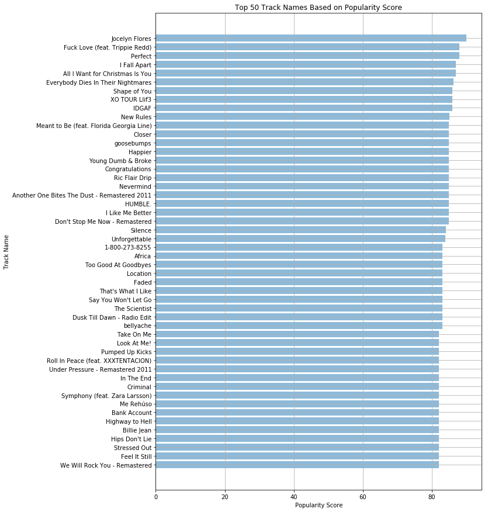

## Contents
{:.no_toc}
*  
{: toc}

## Base Model
### Model Description
For the base model, we decide to do a simple popularity model such that every playlist will get the same number of recommendations. We will get the top 50 popular songs from the train set then we will see how many of these songs will show up in each of the playlist in the test set which will give us the accuracy. We trained the model on 6000 playlists which has 460761 tracks and tested it on 1000 playlist with 67503 tracks. Since the recommendations will be the same for every playlist, the accuracy metric that will be leveraged here is called Recall. We want to see in the 50 recommended tracks, how many of these are actually listed in the test playlist. Then we take the average of all the percentage across all the test playlists and use thatas our model accuracy score. It is
expected that the model accuracy would be very low since it is not yet personalized, but the point of our base model is to ensure that we can come up with a model that can obtain a higher accuracy score.
```
most_popular_track = track_train.groupby(by='track_uri')['popularity'].mean().sort_values(ascending=False).to_frame()
most_popular_track.head(50)
most_popular_track_names = []
for i in most_popular_track.head(50).index.tolist():
    most_popular_track_names.append(tracks_train.loc[tracks_train['track_uri'] == i].track_name.head(1).values[0])
```
### Model Result
```
tracks_test = pd.read_csv('final_wrongpos.csv').groupby(['pos'])['track_uri'].unique()
accuracies=[]
counts = []
for i in tracks_test:
    accuracies.append(np.intersect1d(i, np.array(most_popular_track.index[:50])))
    counts.append(len(np.intersect1d(i, np.array(most_popular_track.index[:50]))))
accuracy = np.average(np.array(counts)/50)
print('accuracy for the base model is', accuracy)
```
Training set size: 6000 playlists

Test set size: 1000 playlists

Accuracy: `0.015719999999999998`.

Below is an image of the top 50 tracks recommended for each playlist:
```
fig, ax = plt.subplots(1,1, figsize=(10,15))
ax.barh(np.arange(len(most_popular_track_names)), most_popular_track.head(50).popularity.values.tolist(), 
        align='center', alpha=0.5)
ax.set_yticks(np.arange(len(most_popular_track_names)))
ax.set_yticklabels(most_popular_track_names)
ax.invert_yaxis()
plt.grid()
plt.xlabel('Popularity Score')
plt.ylabel('Track Name')
plt.title('Top 50 Track Names Based on Popularity Score')
plt.show()
```



## Matrix Factorization
### Model Description
Matrix Factorization revolves around the idea that given each users have rated some items in the sytem, it will predict the items the users have not yet rated.

The central idea of matrix decomposition is to get 2 decomposed matrices ($W$ and $H$) from our main utility matrix ($U$) and get the predicted utility matrix by doing the dot product over the two decomposed matrices. 

Three elements that any matrix factorization approach deals with is:
1. Number of Users ($m$) (in our case, number of playlists)
2. Number of items ($n$) (in our case, number of tracks)
3. Number of components ($k$)

In our case $U$ is a matix of the size $m$ x $n$. And the decomposed matrices will be of the sizes, $W$: $k$ x $m$ and $H$: $n$ x $k$.

$$\hat r_{mn} = \textbf{W}_{m}^{\intercal} \cdot{} \textbf{H}_{n} = \sum\limits_{k} x_{mk}y_{kn}$$

These user and item vectors are often called latent vectors or low-dimensional embeddings in the literature. The *k* attributes are often called the latent factors. We will choose to minimize the square of the difference between all ratings in our dataset ($S$) and our predictions. This produces a loss function of the form

$$L = \sum\limits_{m,n \in S}(r_{mn} - \textbf{W}_{m}^{\intercal} \cdot{} \textbf{H}_{n})^{2} + \lambda_{W} \sum\limits_{m} \left\Vert \textbf{W}_{m} \right\Vert^{2} + \lambda_{H} \sum\limits_{m} \left\Vert \textbf{H}_{n} \right\Vert^{2}$$

### Model Result

In this model, we want to predict top five tracks for each playlist.

```
matrix_fac_model = NMF(n_components=3, init='random', random_state=0)
W = matrix_fac_model.fit_transform(train_util_mat)[:5000]
H = matrix_fac_model.components_

W_dot_H = np.dot(W,H)
train_util_arr = train_util_mat.toarray()[:5000]
W_dot_H_flat = np.concatenate(W_dot_H).ravel()
train_util_arr_flat = np.concatenate(train_util_arr).ravel()
error = np.sqrt(mean_squared_error(train_util_arr_flat, W_dot_H_flat))
```

Training and test set size: 5000 playlists with 90% of tracks

Time taken to build the model: 4 seconds

RMSE: 0.0189

```
W_dot_H = pd.DataFrame(W_dot_H, index=list(train_mapper1.keys())[:3000], columns=list(train_mapper.keys()))
rank = W_dot_H.rank(axis=1,method='dense', ascending=False).astype(int)
rank_ind = rank.where(rank<=5).notnull().values.nonzero()

playlist_sug = {}
for i in list(zip(*rank_ind)):
    if W_dot_H.index[i[0]] in playlist_sug:   
        playlist_sug[W_dot_H.index[i[0]]].append(W_dot_H.columns[i[1]])
    else:
        playlist_sug[W_dot_H.index[i[0]]] = [W_dot_H.columns[i[1]]]

rec_dfrec_df  ==  pdpd..DataFrameDataFram (playlist_sug, index=np.arange(1,6), columns=list(playlist_sug.keys())).T
rec_df.head()
```

Sample recommendations for some playlists:
<div>
<style>
    .dataframe thead tr:only-child th {
        text-align: right;
    }

    .dataframe thead th {
        text-align: left;
    }

    .dataframe tbody tr th {
        vertical-align: top;
    }

</style>
<table border="1" class="dataframe">
  <thead>
    <tr style="text-align: right;">
      <th></th>
      <th>1</th>
      <th>2</th>
      <th>3</th>
      <th>4</th>
      <th>5</th>
    </tr>
  </thead>
  <tbody>
    <tr>
      <th>13000</th>
      <th>7o2CTH4ctstm8TNelqjb51</th>
      <th>4bHsxqR3GMrXTxEPLuK5ue</th>
      <th>4CJVkjo5WpmUAKp3R44LNb</th>
      <th>1AhDOtG9vPSOmsWgNW0BEY</th>
      <th>40riOy7x9W7GXjyGp4pjAv</th>
    </tr>
    <tr>
      <th>13001</th>
      <th>5XJJdNPkwmbUwE79gv0NxK</th>
      <th>5dNfHmqgr128gMY2tc5CeJ</th>
      <th>7BKLCZ1jbUBVqRi2FVlTVw</th>
      <th>5Q0Nhxo0l2bP3pNjpGJwV1</th>
      <th>0XUfyU2QviPAs6bxSpXYG4</th>
    </tr>
    <tr>
      <th>13002</th>
      <th>5XJJdNPkwmbUwE79gv0NxK</th>
      <th>5dNfHmqgr128gMY2tc5CeJ</th>
      <th>7BKLCZ1jbUBVqRi2FVlTVw</th>
      <th>5Q0Nhxo0l2bP3pNjpGJwV1</th>
      <th>0XUfyU2QviPAs6bxSpXYG4</th>
    </tr>
    <tr>
      <th>13003</th>
      <th>5XJJdNPkwmbUwE79gv0NxK</th>
      <th>5dNfHmqgr128gMY2tc5CeJ</th>
      <th>7BKLCZ1jbUBVqRi2FVlTVw</th>
      <th>5Q0Nhxo0l2bP3pNjpGJwV1</th>
      <th>0XUfyU2QviPAs6bxSpXYG4</th>
    </tr>
    <tr>
      <th>13004</th>
      <th>7o2CTH4ctstm8TNelqjb51</th>
      <th>4bHsxqR3GMrXTxEPLuK5ue</th>
      <th>4CJVkjo5WpmUAKp3R44LNb</th>
      <th>1AhDOtG9vPSOmsWgNW0BEY</th>
      <th>40riOy7x9W7GXjyGp4pjAv</th>
    </tr>
  </tbody>
</table>
</div>


## Model Analysis and Conclusions
- Cold Start Problem

To find good choices of songs for new playlists with relativley few prior playlist entires, base model is a good approach. In this case, it will provide the same tracks to new playlists. Even though it's simple, it is error prone.

- Automatic Playlist Generation

Matrix Factorization is a great way to recommend songs to base playlists. With this approach, we got a overall RMSE of 0.0189. This model can be expanded to suggest as many number of songs for each playlist as possible by increasing the number top recommendations.


